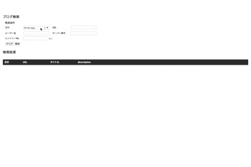

Assignment
==========

[FC2 Blog RSS Search System](http://fc2blogs-search.esy.es/)

## Description

### Prerequirement
- Built within 1 week
- **Any frameworks are prohibited**
- **The mod_rewrite is prohibited**

### Required Function
- cron により5分に一度、FC2 BLOG の新着情報 RSS(http://blog.fc2.com/newentry.rdf) を取得し、MySQLに保存する
- Web ページ上で指定した検索条件に一致したブログの一覧を表示する
- 検索条件は、日付、URL、ユーザー名、サーバー番号、エントリーNo.
- 検索結果の表示内容は日付、URL、タイトル、description
- 検索した時に新着から表示する
- ページャー機能をつける
- エントリーNo.の検索条件は「エントリーNo.が○○以上」という指定を可能にする
- 一度指定した検索条件は Cookie に保存し、次回の訪問時にフォーム内に表示されるようにする
- MySQL に保存したデータは、2週間以上古いデータは自動削除する

## Demo

http://fc2blogs-search.esy.es/


## Requirement
### Database

- MySQL 5.5+

### PHP
PHP Version 5.5+

- PDO
- [PHPUnit](https://phpunit.de/)

### JavaScript

- [Mocha](https://mochajs.org/)

### Web Browser

- Firefox - Latest Version
- Chrome - Latest Version
- Safari - Latest Version
- Internet Explorer - IE 9+

## Install

1. deploy all files to a certain directory ex) /tmp/exam0098/
2. create tables with docs/sql/ddl/tables.ddl
3. run ./bin/setup.sh
```
ex) $ /bin/bash /tmp/exam0098/bin/setup.sh
**スクリプト実行後の入力内容は以下を参考に環境に合わせて入力する**
セットアップを開始します。 (Y/n) >> y
1. WEB 設定
公開ディレクトリを絶対パスでを入力してください >> /home/exam0098/public_html
...
2. MySQL 設定
HOST を入力してください >> 127.0.0.1
DB NAME を入力してください >> exam0098
USER を入力してください >> exam0098
PASSWORD を入力してください >> xxxx
...
設定は完了しました。
```

## Licence

[MIT](https://opensource.org/licenses/MIT)

## Author

[tomosm](https://github.com/tomosm)
